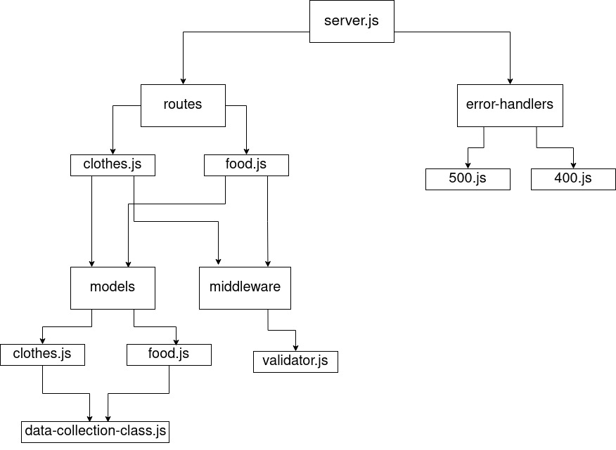

# basic-api-server

A simple API server with tow routers and two models (Food and Clothes) with tests.

- [Submission Pull Request](https://github.com/401-js-WesamAlmasri/api-server/pull/1)
- [Tests](https://github.com/401-js-WesamAlmasri/api-server/actions/)
- [Deployed url](https://api-ser-mongo.herokuapp.com/)

## Setup

`.env Requierments`

- `PORT` - port number
- `MONGODB_URI` - mongodb connection string
- `MONGOOSE_TEST_URI` - test mongodb connection string

## Running the app

1. clone the repo.
2. Enter the command `npm start`
3. Endpoints
   1. `/api/v1/food`
       - method : POST
          - create a new food record
       - method : Get
         - get all food records
       - response: JSON

         ```json
          {
            "_id": "60a52e3c2324ab4b3ad1174a",
            "name": "hamar ",
            "type": "121212",
            "__v": 0
         }
         ```

         or

         ```json
         [
            {
            "_id": "60a52e3c2324ab4b3ad1174a",
            "name": "hamar ",
            "type": "121212",
            "__v": 0
            },
            {
            "_id": "60a52e3c2324ab4b3ad1174a",
            "name": "hamar ",
            "type": "121212",
            "__v": 0
            },
            ....
         ]
         ```

   2. `/api/v1/food/:id`
       - method : PUT
          - update the food record with the id
       - method : DELETE
         - delete the food record with the id
       - Respons: JSON

         ```json
          {
            "_id": "60a52e3c2324ab4b3ad1174a",
            "name": "hamar ",
            "type": "121212",
            "__v": 0
         }
         ```

   3. `/api/v1/clothes`
       - method : POST
          - create a new cloth record
       - method : Get
         - get all clothes records
       - response: JSON

         ```json
          {
            "_id": "60a52e3c2324ab4b3ad1174a",
            "name": "hamar ",
            "type": "121212",
            "__v": 0
         }
         ```

         or

         ```json
         [
            {
            "_id": "60a52e3c2324ab4b3ad1174a",
            "name": "hamar ",
            "type": "121212",
            "__v": 0
            },
            {
            "_id": "60a52e3c2324ab4b3ad1174a",
            "name": "hamar ",
            "type": "121212",
            "__v": 0
            },
            ....
         ]
         ```

   4. `/api/v1/clothes/:id`
       - method : PUT
          - update the cloth record with the id
       - method : DELETE
         - delete the cloth record with the id
       - Respons: JSON

         ```json
          {
            "_id": "60a52e3c2324ab4b3ad1174a",
            "name": "hamar ",
            "type": "121212",
            "__v": 0
         }
         ```

4. Test
   - Unit Tests: run the command `npm run test`
   - Lint Tests: run the command `npm run lin`

## UML


